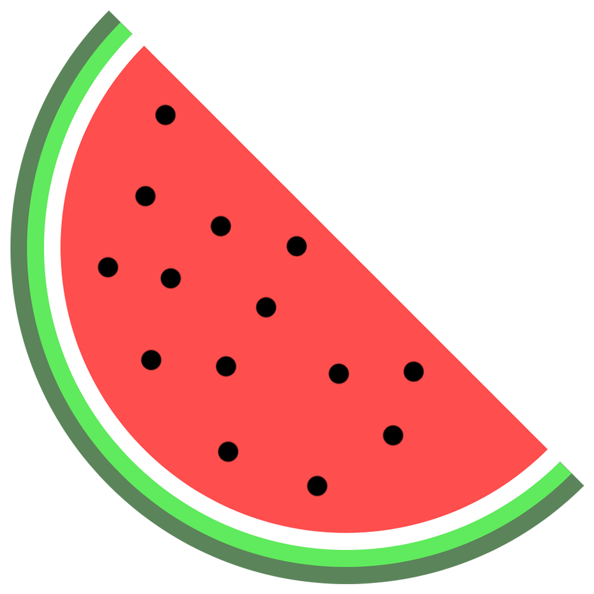

<p align="center"> 
	
</p>
<div align="center">
    
    
<h1 align="center">
	watermelon
</h1>
<p align="center">
  A toy object-oriented programming language based on LLVM
</p>
</div>

## ✨ Highlights

*   **Custom LLVM Passes:** Implemented multiple optimization passes including **Mem2reg**, **Dead Code Elimination (DCE)**, **Constant Propagation**, and **Common Subexpression Elimination (CSE)** to significantly optimize the generated IR.
*   **Garbage Collection:** Built-in **Mark & Sweep** garbage collection mechanism for automatic memory management.
*   **Object-Oriented:** Supports classes, inheritance, and polymorphism via Virtual Method Tables (VTable).


## 🛠️ Build & Installation

### Prerequisites
*   C++17 Compiler (GCC/Clang)
*   CMake (3.16+)
*   LLVM 14

### Installation Steps

1.  **Clone the repository:**
    ```bash
    git clone https://github.com/mumu12641/watermelon.git
    cd watermelon
    ```

2.  **Build:**
    
    ```bash
    mkdir build && cd build
    cmake ..
    make -j$(nproc)
    ```


3.  **Install:**
    
    ```bash
    sudo make install
    ```


> **Note:** The executable `watermelon` will be installed to `/usr/local/bin/`. Runtime libraries and configuration files will be stored in `~/.watermelon/`.


## 🚀 Usage

Compile a Watermelon source file:

```bash
watermelon your_file.wm
```

### Artifacts
The compiler generates the following files in the current directory:
*   `output`: The final executable binary.
*   `output.ll`: Raw LLVM IR.
*   `output_opt.ll`: Optimized LLVM IR (after applying custom passes).


## 📝 Examples

### 1. Polymorphism & Inheritance

```typescript
class Shape(name:str){
    fn get_area() -> int{
        return 0;
    }
    fn print(){
        print_str("Name: " + name + "\n");
        print_str("area: ");
        print_int(self.get_area());
        println();
        return;
    }
}

class Square(a:int = 0) inherits Shape("Square"){
    fn set(_a:int){
        a = _a;
        return;
    }
    fn get_area() -> int{
        return a * a;
    }
}

class Rectangle(a:int = 0, b:int = 0) inherits Shape("Rectangle"){
    fn set(_a:int, _b:int){
        a = _a;
        b = _b;
        return;
    }
    fn get_area() -> int{
        return a * b;
    }
}

fn print_shape(s:Shape) -> Shape{
    s.print();
    return s;
}

fn main() ->int {
    val a = Square(2);
    val b = Rectangle(2, 3);
    val c = b;
    val d = print_shape(a);
    d.print();
    return 0;
}
```

### 2. Linked List

```typescript
class Node(_data:int = 0){
    var _next:Node;

    fn set_data(__data:int)->void{
        _data = __data;
        return;
    }

    fn get_data() -> int{
        return _data;
    }

    fn set_next(next:Node) -> void{
        _next = next;
        return;
    }

    fn get_next() -> Node{
        return _next;
    }
}

class LinkedList(_head:Node){
    var tail:Node;
    var size:int;

    init{
        tail = _head;
        size = 1;
    }

    fn insert(node:Node) -> void{
        tail.set_next(node);
        tail = node;
        size = size + 1;
        return;
        
    }
    
    fn get_head() -> Node{
        return _head;
    }

    fn get_size() -> int{
        return size;
    }
}

fn main() -> void{
    var n1 = Node(1);
    var n2 = Node(2);
    var n3 = Node(3);
    var n4 = Node(4);

    var l = LinkedList(n1);
    l.insert(n2);
    l.insert(n3);
    l.insert(n4);

    var cur = l.get_head();
    for(i in Range(l.get_size())){
        print_int(cur.get_data());
        println();
        cur = cur.get_next();
    }
    return;
}
```
